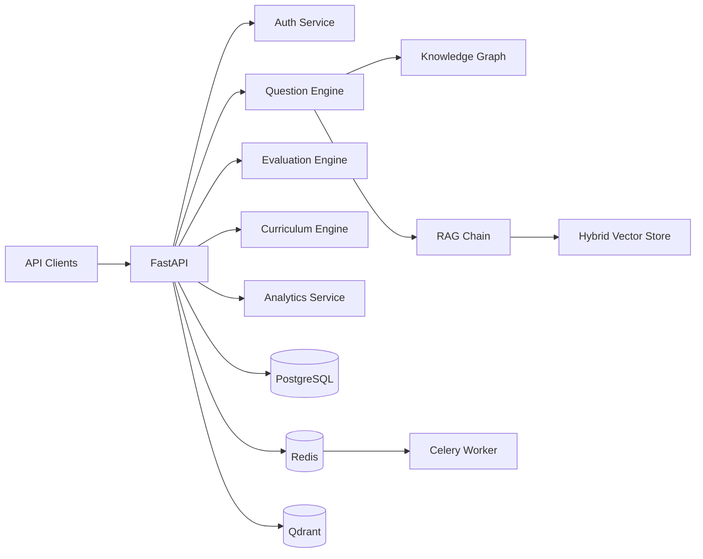

# Architecture Diagram

```mermaid
flowchart LR
    UI[API Clients] --> API[FastAPI]
    API --> Auth[Auth Service]
    API --> Q[Question Engine]
    API --> E[Evaluation Engine]
    API --> C[Curriculum Engine]
    API --> A[Analytics Service]
    Q --> KG[Knowledge Graph]
    Q --> RAG[RAG Chain]
    RAG --> VS[Hybrid Vector Store]
    API --> DB[(PostgreSQL)]
    API --> Redis[(Redis)]
    API --> Qdrant[(Qdrant)]
    Redis --> Celery[Celery Worker]
```
