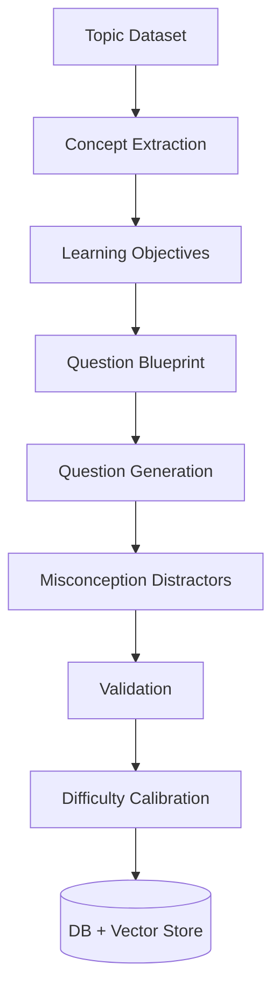

# Data Flow Diagram

```mermaid
flowchart TB
    Topic[Topic Dataset] --> Extract[Concept Extraction]
    Extract --> Objectives[Learning Objectives]
    Objectives --> Blueprint[Question Blueprint]
    Blueprint --> Generate[Question Generation]
    Generate --> Distractors[Misconception Distractors]
    Distractors --> Validate[Validation]
    Validate --> Calibrate[Difficulty Calibration]
    Calibrate --> Store[(DB + Vector Store)]
```
