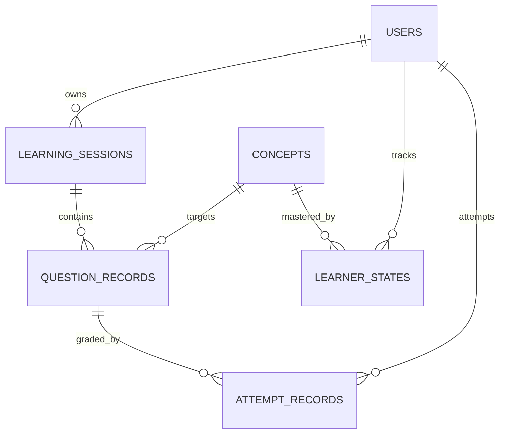

# ER Diagram

```mermaid
erDiagram
    USERS ||--o{ LEARNING_SESSIONS : owns
    USERS ||--o{ LEARNER_STATES : tracks
    USERS ||--o{ ATTEMPT_RECORDS : attempts
    LEARNING_SESSIONS ||--o{ QUESTION_RECORDS : contains
    QUESTION_RECORDS ||--o{ ATTEMPT_RECORDS : graded_by
    CONCEPTS ||--o{ QUESTION_RECORDS : targets
    CONCEPTS ||--o{ LEARNER_STATES : mastered_by
```
