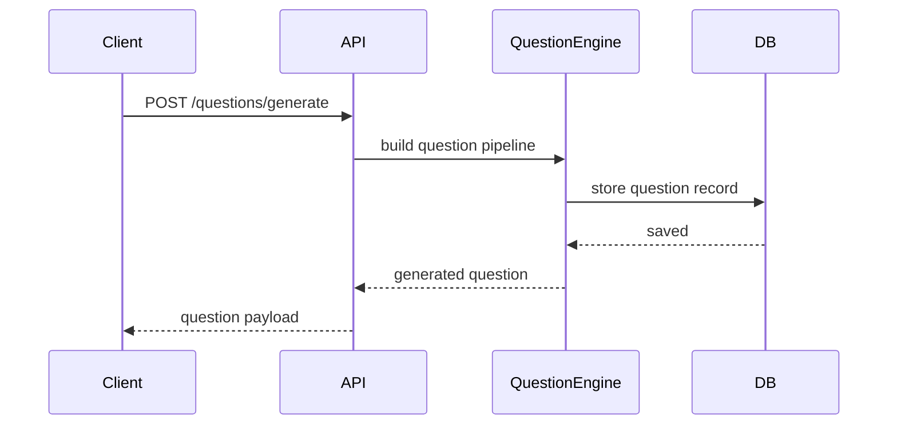

# Sequence Diagrams

```mermaid
sequenceDiagram
    participant Client
    participant API
    participant QuestionEngine
    participant DB
    Client->>API: POST /questions/generate
    API->>QuestionEngine: build question pipeline
    QuestionEngine->>DB: store question record
    DB-->>QuestionEngine: saved
    QuestionEngine-->>API: generated question
    API-->>Client: question payload
```
